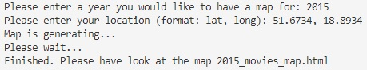
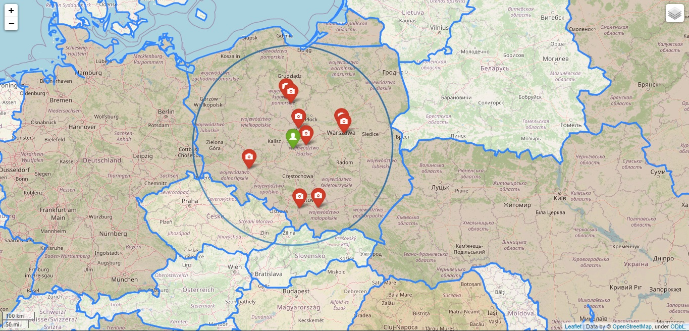
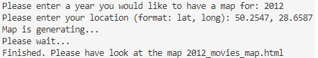
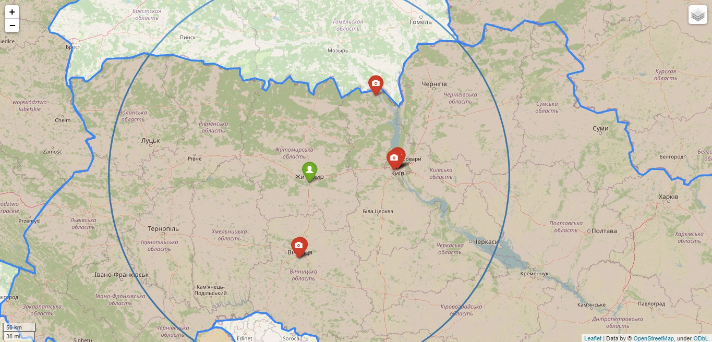

# Program description

## 1. Short information about module
The module builds a file containing a map showing the locations of the movies. In order to avoid an excessive number of labels, the user must enter the year of creation and the coordinates of the location that interests him.

**Required data files:** europe_loc.csv, world.json

**The program works only for locations in the following countries:**
* Ukraine, 
* Poland, 
* Czech Republic,
* Slovenia.

## 2. Description of the received information
After entering the data, the user receives a generated map of no more than 10 movies within a radius of 300 km from him. User can also compare the population of different countries. The color scheme will help him in this, where the darker the color - the larger the population.

## 3. Example of program operation

## 4. Description of the structure of the html file
Html file consist of *head*, *body* and *script*.
The map itself is created in the tag "body".
The "script" tag contains a description of all labels and layers.
The "head" contain meta and script tag.